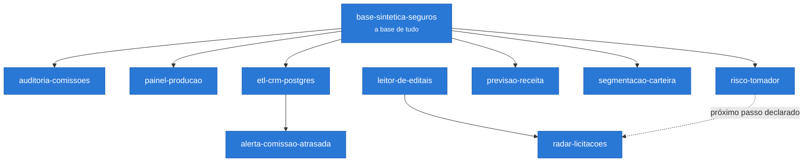

# Lucas Neves

### Gerente de Projetos · Dados e Automação

Trabalho num grupo de três empresas: duas corretoras de seguro e uma construtora que vive de licitação.

Meu trabalho é pegar um problema do negócio e levar até o fim. Entender o número, escrever o código, colocar no servidor e explicar o resultado pra quem decide. Não é só dados e não é só gestão. É o caminho inteiro, do problema até a coisa funcionando.

Boa parte do que eu faço não é análise complicada. É descobrir que dois relatórios estão medindo coisas diferentes, ou que uma planilha soma até a linha errada há seis meses. Coisa pequena que custa caro.

---

## 🧪 Sobre a trilha

**Os dez projetos da trilha vivem na mesma empresa fictícia**, a Norte Garantia, uma corretora de seguro garantia. Os dados são gerados artificialmente, com a estrutura de uma corretora real: apólice, parcela, prêmio, comissão, demonstrativo da seguradora e extrato bancário. Nenhum dado de cliente ou de empresa real é usado, em nenhum deles.

Isso é escolha, não acaso. Dez projetos soltos com dataset baixado da internet mostram dez exercícios. Dez projetos na mesma operação mostram uma operação sendo construída, e cada um usa o resultado do anterior. Preferi profundidade a variedade. Na fase de IA o dado sintético muda de forma: em vez de planilha, editais fictícios escritos na estrutura da Lei 14.133/2021, com órgãos inventados e defeitos plantados com gabarito.

**E é um recorte, de propósito.** A trilha cobre a parte de dados e automação do meu trabalho, que é a que cabe num repositório. Marketing, vendas e licitação também fazem parte do meu dia a dia e não moram aqui.

---

## 🗺️ A trilha

Os dez não são uma lista, são um encadeamento: cada um usa o resultado do anterior. Sete nascem da mesma base sintética; os dois últimos formam uma esteira própria, de editais, que fecha num produto no ar.

Cada um prova uma coisa diferente, e nenhum repete o outro: ler o dado, conferir, apresentar, automatizar, prever, e virar produto.

**Os dez estão no ar.** A linha pontilhada é o que o próprio radar declara como próximo passo: usar o risco do tomador para calibrar a comissão estimada.

---

## 🗂️ Os projetos

### 1 · Fundação · *ler e conferir o número*

| Projeto | O que resolve | Status |
|---|---|---|
| **[base-sintetica-seguros](https://github.com/Lucasnevesads/base-sintetica-seguros)** | Como mostrar trabalho com dado financeiro sem expor dado de cliente: uma corretora inteira que não existe, com dado falso que se comporta como o de verdade. É o alicerce dos outros nove. | ✅ |
| **[auditoria-comissoes](https://github.com/Lucasnevesads/auditoria-comissoes)** | A diretoria acha que sumiram R$ 630 mil de comissão. Não sumiu nada: dois relatórios medem coisas diferentes. Reconstrói a conta até o centavo e acha 24 erros de 24. | ✅ |
| **[painel-producao](https://github.com/Lucasnevesads/painel-producao)** · [ver no ar](https://lucasnevesads.github.io/painel-producao/) | Uma página que o dono da corretora abre no celular e entende em dez segundos, sem planilha e sem pedir relatório pra ninguém. | ✅ |

### 2 · Esteira · *fazer o dado andar sozinho*

| Projeto | O que resolve | Status |
|---|---|---|
| **[etl-crm-postgres](https://github.com/Lucasnevesads/etl-crm-postgres)** | Puxa os dados do sistema de vendas todo dia, sem ninguém apertar botão, e sem quebrar quando o servidor do outro lado reclama. Idempotente, incremental e auditável. | ✅ |
| **[alerta-comissao-atrasada](https://github.com/Lucasnevesads/alerta-comissao-atrasada)** | Avisa no WhatsApp quando uma comissão passou do prazo de repasse, no dia em que passou, e não três meses depois no fechamento. | ✅ |

### 3 · Previsão · *olhar pra frente*

| Projeto | O que resolve | Status |
|---|---|---|
| **[risco-tomador](https://github.com/Lucasnevesads/risco-tomador)** | Qual proposta merece uma segunda olhada antes de ir para a seguradora, e por quê. Revisando 20% da fila encontra 60% dos sinistros, e cada posição vem com um parecer. | ✅ |
| **[previsao-receita](https://github.com/Lucasnevesads/previsao-receita)** | Quanto de comissão entra no caixa nos próximos três meses, separando o que já está vendido do que ainda precisa ser vendido. 45% do trimestre não é previsão, é soma. | ✅ |
| **[segmentacao-carteira](https://github.com/Lucasnevesads/segmentacao-carteira)** | Quem, dentro de quem já é cliente, merece uma ligação esta semana. 80% da comissão vem de 24 dos 120 clientes, e três deles pararam de comprar. | ✅ |

### 4 · IA e produto · *virar coisa que alguém usa*

| Projeto | O que resolve | Status |
|---|---|---|
| **[leitor-de-editais](https://github.com/Lucasnevesads/leitor-de-editais)** | Lê um edital de licitação e devolve o parecer com conferência: o que ele exige de garantia, qual número não bate e o que ele **não diz**. Extrator por regras ou por IA, com a mesma validação, porque campo não encontrado é diferente de campo vazio. | ✅ |
| **[radar-licitacoes](https://github.com/Lucasnevesads/radar-licitacoes)** · [ver no ar](https://lucasnevesads.github.io/radar-licitacoes/) | Fecha a trilha: doze editais viram uma fila de cotação ordenada pelo prazo, uma lista do que travou (com o motivo e a conta) e o que dá pra ignorar sem culpa. | ✅ |

✅ no ar

---

## 🧰 Ferramentas

**No dia a dia**
`Python` `Pandas` `SQL` `PostgreSQL` `Excel` `n8n` `API REST` `Webhook` `Docker` `VPS Linux` `Nginx` `GitHub Pages` `HTML` `CSS` `JavaScript` `PHP` `Scikit-learn` `Modelo explicável` `Séries temporais` `Simulação` `API de LLM (Claude)`

**Estudando na pós, ainda sem projeto público aqui**
`Deep learning` `AWS SageMaker`

A separação é de propósito. Ferramenta que aparece na primeira lista tem código neste perfil ou coisa rodando em produção no meu trabalho. A segunda é honesta sobre onde eu estou: sei usar, mas ainda não publiquei nada aqui que prove.

---

## 🎓 Formação

- **Pós-graduação em Ciência de Dados** · em conclusão
- **Pós-graduação em Machine Learning** · em conclusão
- **Pós-graduação em Gestão Estratégica de Negócios e Inovação**
- **Bacharelado em Administração**

---

Castanhal, Pará.
